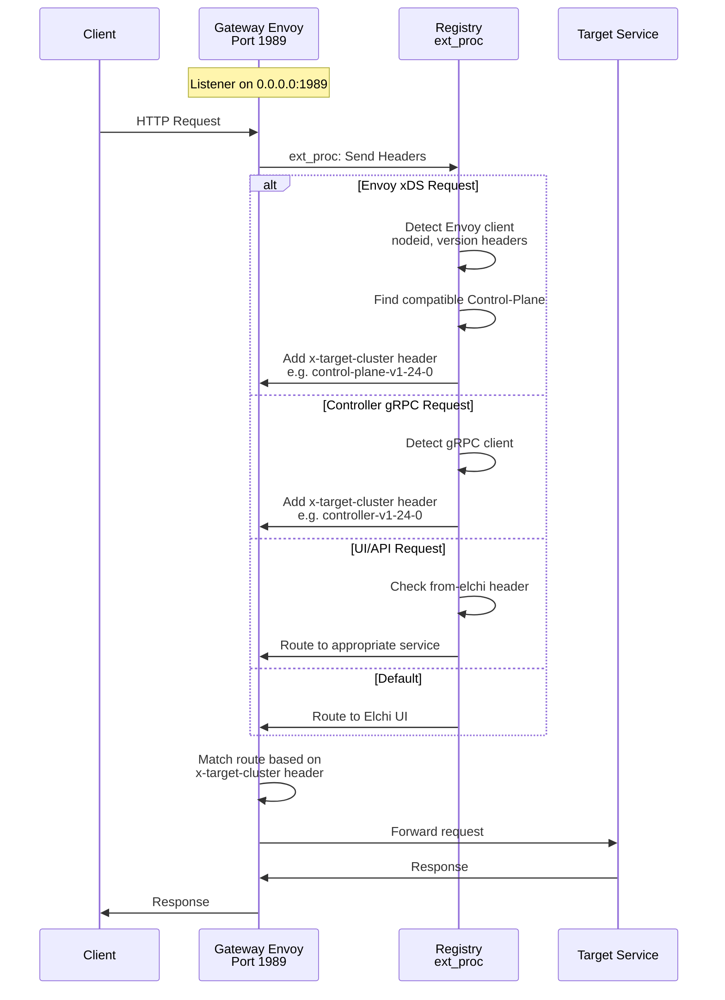
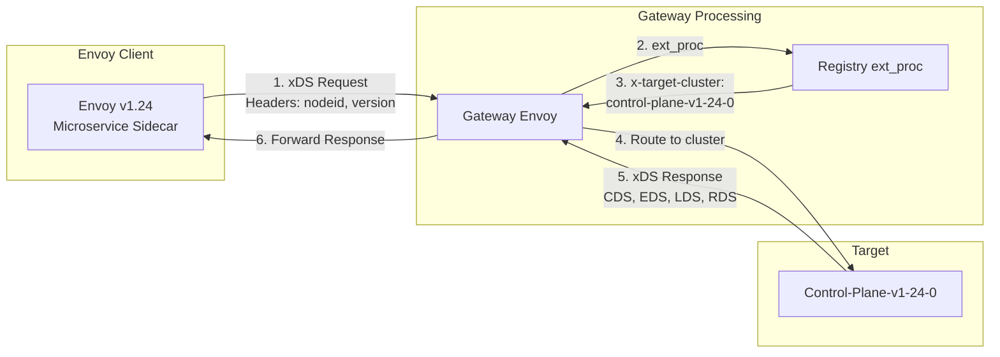
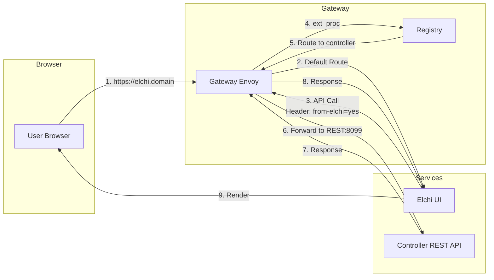
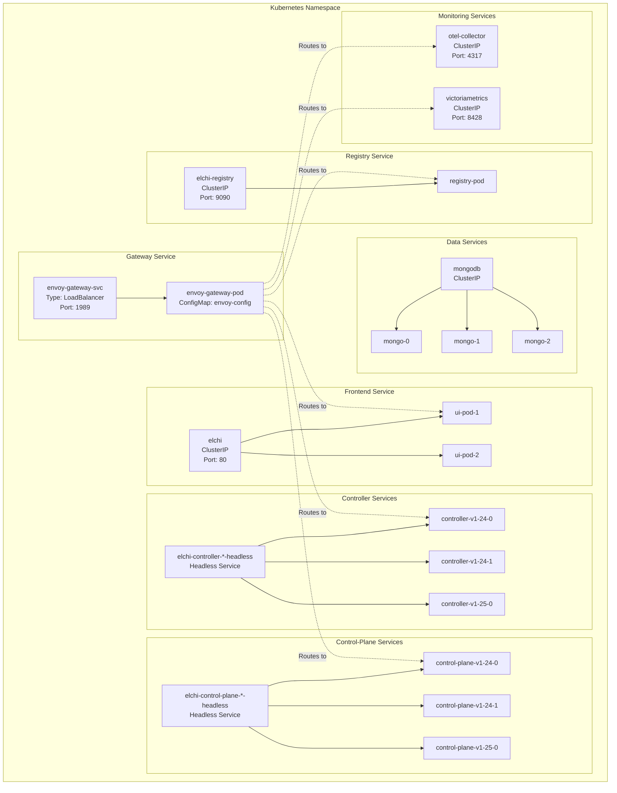
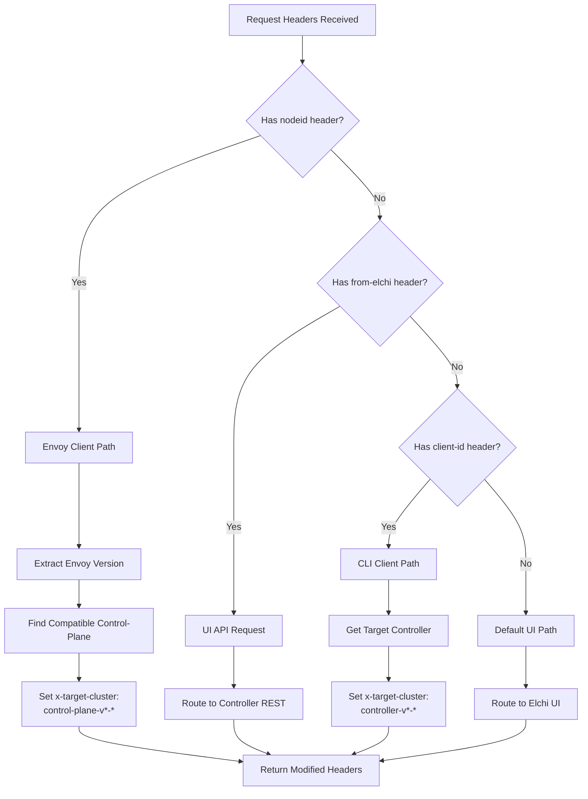
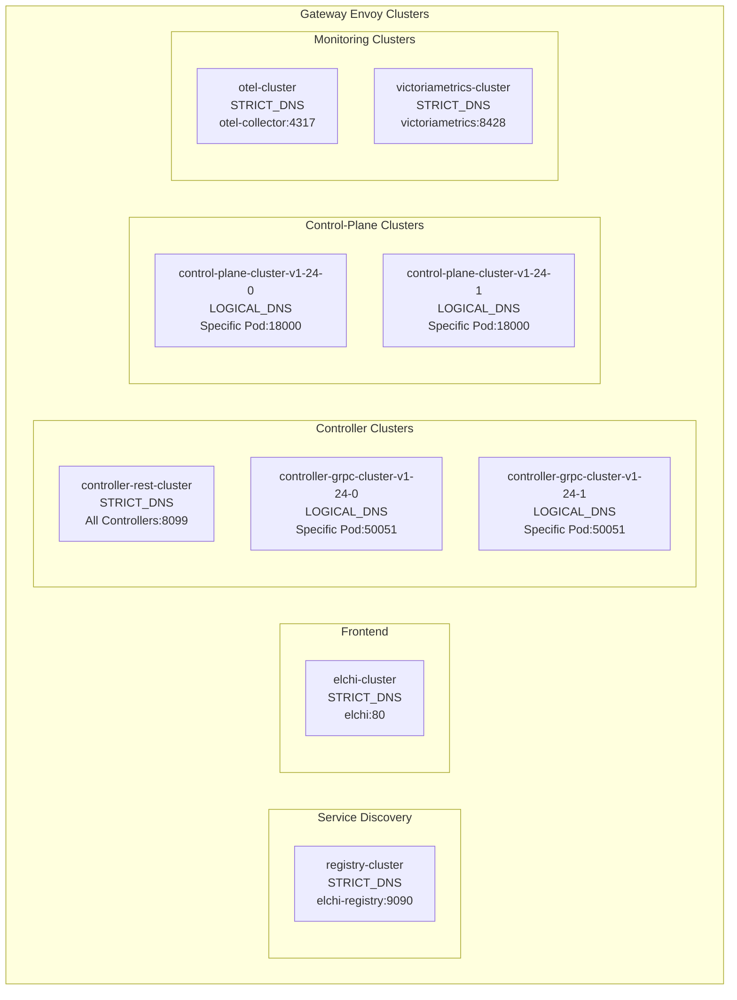
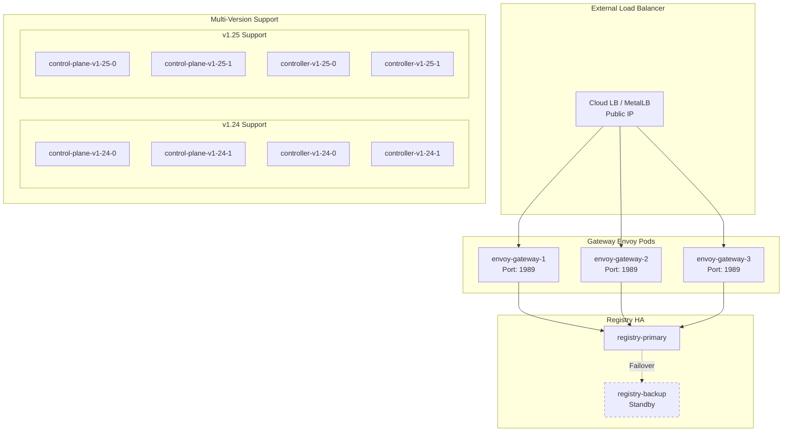
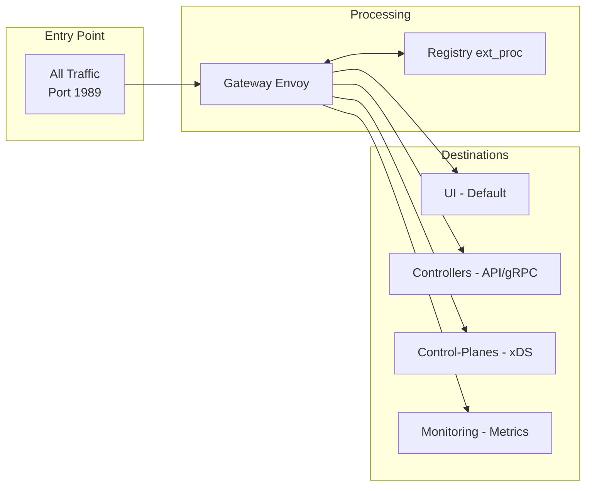

# Elchi Platform Complete Architecture with Gateway Envoy

## System Overview - Traffic Flow Through Gateway Envoy

```mermaid
graph TB
    subgraph "External Traffic"
        USER[Users/Browsers]
        ENVOY_CLIENT[Envoy Clients<br/>Microservices]
    end

    subgraph "Gateway Layer - Port 1989"
        GATEWAY[Gateway Envoy<br/>Port: 1989<br/>Traffic Router & Load Balancer]
    end

    subgraph "Registry Service - Port 9090"
        REG[Elchi-Registry<br/>ext_proc Service<br/>Dynamic Routing Decisions]
    end

    subgraph "Frontend - Port 80"
        UI[Elchi UI<br/>React Application]
    end

    subgraph "Controller Pods"
        CTRL1[Controller-v1-24-0<br/>REST: 8099<br/>gRPC: 50051]
        CTRL2[Controller-v1-24-1<br/>REST: 8099<br/>gRPC: 50051]
        CTRL3[Controller-v1-25-0<br/>REST: 8099<br/>gRPC: 50051]
    end

    subgraph "Control-Plane Pods"
        CP1[Control-Plane-v1-24-0<br/>xDS: 18000]
        CP2[Control-Plane-v1-24-1<br/>xDS: 18000]
        CP3[Control-Plane-v1-25-0<br/>xDS: 18000]
    end

    subgraph "Database"
        DB[MongoDB<br/>Replica Set]
    end

    subgraph "Monitoring"
        OTEL[OTEL Collector<br/>Port: 4317]
        VM[VictoriaMetrics<br/>Port: 8428]
    end

    USER -->|HTTP/HTTPS| GATEWAY
    ENVOY_CLIENT -->|xDS Requests| GATEWAY

    GATEWAY -->|ext_proc<br/>Header Processing| REG
    REG -->|Routing Decision<br/>x-target-cluster| GATEWAY

    GATEWAY -->|Default Route| UI
    GATEWAY -->|from-elchi header| CTRL1
    GATEWAY -->|from-elchi header| CTRL2
    GATEWAY -->|from-elchi header| CTRL3

    GATEWAY -->|x-target-cluster:<br/>controller-*| CTRL1
    GATEWAY -->|x-target-cluster:<br/>controller-*| CTRL2
    GATEWAY -->|x-target-cluster:<br/>controller-*| CTRL3

    GATEWAY -->|x-target-cluster:<br/>control-plane-*| CP1
    GATEWAY -->|x-target-cluster:<br/>control-plane-*| CP2
    GATEWAY -->|x-target-cluster:<br/>control-plane-*| CP3

    GATEWAY -->|/opentelemetry/*| OTEL
    GATEWAY -->|/api/v1/query_range| VM

    UI -->|API Calls| GATEWAY
    
    CTRL1 --> DB
    CTRL2 --> DB
    CTRL3 --> DB
    
    CP1 --> DB
    CP2 --> DB
    CP3 --> DB

    CTRL1 -.->|Register| REG
    CTRL2 -.->|Register| REG
    CTRL3 -.->|Register| REG

    CP1 -.->|Register| REG
    CP2 -.->|Register| REG
    CP3 -.->|Register| REG

    classDef gateway fill:#ffebee,stroke:#c62828,stroke-width:3px
    classDef registry fill:#f3e5f5,stroke:#4a148c,stroke-width:2px
    classDef frontend fill:#e1f5fe,stroke:#01579b,stroke-width:2px
    classDef controller fill:#fff3e0,stroke:#e65100,stroke-width:2px
    classDef controlplane fill:#e8f5e9,stroke:#1b5e20,stroke-width:2px
    classDef database fill:#fce4ec,stroke:#880e4f,stroke-width:2px
    classDef monitoring fill:#e0f7fa,stroke:#00838f,stroke-width:2px

    class GATEWAY gateway
    class REG registry
    class UI frontend
    class CTRL1,CTRL2,CTRL3 controller
    class CP1,CP2,CP3 controlplane
    class DB database
    class OTEL,VM monitoring
```

## Gateway Envoy Routing Logic

## Detailed Service Communication Flow

### 1. Envoy Client xDS Request Flow

### 2. UI to Backend Flow

## Kubernetes Service Architecture

## Registry ext_proc Decision Flow

## Gateway Envoy Clusters Configuration

## Complete Request Types and Routing

| Request Type | Source | Headers | Target Cluster | Backend Service |
|-------------|--------|---------|----------------|-----------------|
| UI Access | Browser | - | elchi-cluster | Elchi UI React |
| UI API Call | Elchi UI | from-elchi=yes | controller-rest-cluster | Controller REST API |
| Envoy xDS | Envoy Proxy | nodeid, envoy-version | control-plane-cluster-* | Control-Plane xDS |
| CLI gRPC | CLI Client | client-id, x-target-cluster | controller-grpc-cluster-* | Controller gRPC |
| Metrics | OTEL Agent | - | otel-cluster | OTEL Collector |
| Queries | Prometheus/Grafana | - | victoriametrics-cluster | VictoriaMetrics |
| Health Check | K8s | - | Direct to Pods | TCP Check |

## High Availability and Scaling

## Key Architecture Principles

### 1. **Gateway Envoy as Central Router**
- All traffic enters through Gateway Envoy on port 1989
- Handles HTTP/1.1, HTTP/2, and gRPC protocols
- Provides load balancing, health checking, and failover

### 2. **Registry as ext_proc Service**
- Processes all request headers via External Processing filter
- Makes intelligent routing decisions based on request metadata
- Maintains service discovery and routing tables
- No direct traffic handling, only routing decisions

### 3. **Version-Based Pod Naming**
- Pods named with version and instance: `service-v1-24-0`
- Enables precise routing to specific versions
- Supports rolling updates and canary deployments

### 4. **Headless Services for Direct Pod Access**
- Controllers and Control-Planes use headless services
- Gateway routes directly to specific pods
- Enables session affinity and version-specific routing

### 5. **Multi-Protocol Support**
- REST API on port 8099 - Controllers
- gRPC on port 50051 - Controllers  
- xDS gRPC on port 18000 - Control-Planes
- HTTP/2 with keepalive for long-lived connections

## Traffic Flow Summary

This architecture provides:
- **Single entry point** for all traffic
- **Dynamic routing** based on request characteristics
- **Version-aware** service discovery
- **High availability** with multiple replicas
- **Observability** with integrated monitoring
- **Scalability** through horizontal pod scaling