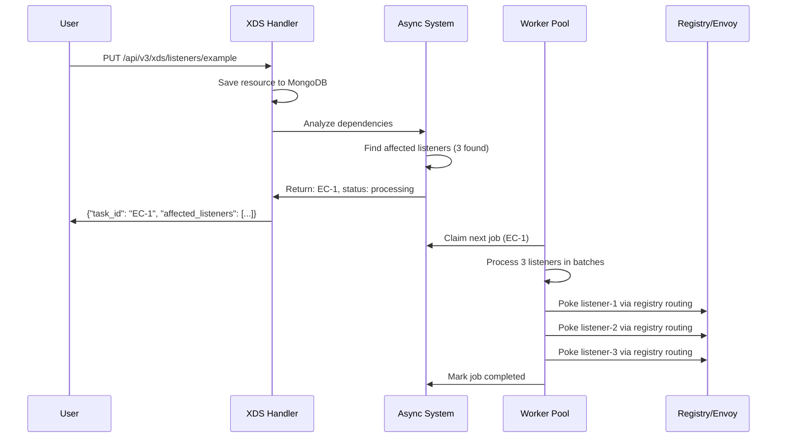
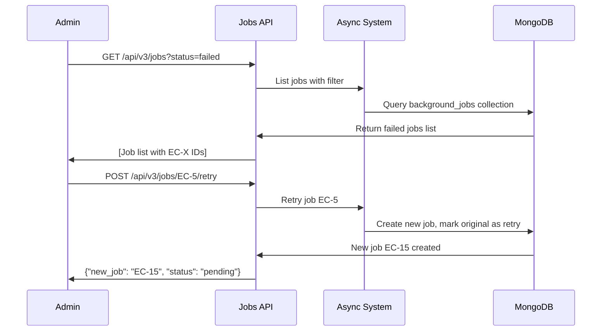
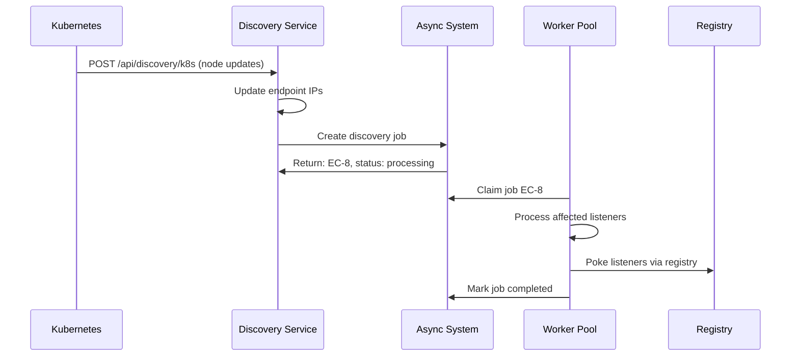

# Elchi Async Job System Documentation

## 📋 Overview

The Elchi Async Job System is a comprehensive, distributed background job processing system designed to handle massive snapshot updates efficiently. It replaces the synchronous snapshot update process with an asynchronous, MongoDB-centric approach that supports multi-pod Kubernetes deployments.

## 🎯 Key Features

- **Always Async**: Even 1+ listener triggers background job creation
- **Human-Friendly Task IDs**: EC-1, EC-2, EC-3... for easy tracking
- **Multi-Pod Support**: MongoDB-based job coordination across multiple controller instances
- **Registry Integration**: Preserves existing header-based routing through Envoy ext_proc
- **Real-time Monitoring**: Built-in metrics and health monitoring
- **Manual Job Management**: Complete API for job control and retry operations
- **Graceful Fallbacks**: Automatic fallback to synchronous processing on failures

## 🏗️ System Architecture

```
┌─────────────────┐    ┌─────────────────┐    ┌─────────────────┐
│   Controller    │    │   Controller    │    │   Controller    │
│     Pod 1       │    │     Pod 2       │    │     Pod 3       │
│                 │    │                 │    │                 │
│ ┌─────────────┐ │    │ ┌─────────────┐ │    │ ┌─────────────┐ │
│ │AsyncJobSys  │ │    │ │AsyncJobSys  │ │    │ │AsyncJobSys  │ │
│ │Workers: 5   │ │    │ │Workers: 5   │ │    │ │Workers: 5   │ │
│ └─────────────┘ │    │ └─────────────┘ │    │ └─────────────┘ │
└─────────────────┘    └─────────────────┘    └─────────────────┘
         │                       │                       │
         └───────────────────────┼───────────────────────┘
                                 │
                         ┌─────────────────┐
                         │    MongoDB      │
                         │                 │
                         │ ┌─────────────┐ │
                         │ │background_  │ │
                         │ │jobs         │ │
                         │ └─────────────┘ │
                         │ ┌─────────────┐ │
                         │ │job_counters │ │
                         │ └─────────────┘ │
                         └─────────────────┘
                                 │
                         ┌─────────────────┐
                         │    Registry     │
                         │                 │
                         │  Envoy xDS      │
                         │  Routing &      │
                         │  Poke Service   │
                         └─────────────────┘
```

## 📦 Package Structure

```
pkg/async/
├── README.md                    # This documentation
├── async.go                     # Main async system interface & implementation
├── types.go                     # Common type definitions & interfaces
│
├── job/                         # Job management
│   ├── models.go               # Job data structures & MongoDB schemas
│   └── manager.go              # Job lifecycle management & atomic operations
│
├── worker/                      # Worker pool management
│   ├── pool.go                 # Worker pool coordination
│   └── worker.go               # Individual worker implementation
│
├── analysis/                    # Dependency analysis
│   └── analyzer.go             # Resource dependency analysis
│
└── monitoring/                  # System monitoring
    └── metrics.go              # Performance metrics & health monitoring
```

## 🔧 Core Components

### 1. AsyncJobSystem Interface

Main entry point for all async operations:

```go
type AsyncJobSystem interface {
    // Job management
    CreateJob(ctx context.Context, req *CreateJobRequest) (*Job, error)
    GetJob(ctx context.Context, jobID string) (*Job, error)
    GetJobByHumanID(ctx context.Context, humanID string) (*Job, error)
    
    // Analysis
    AnalyzeDependencies(ctx context.Context, req *AnalysisRequest) (*DependencyAnalysis, error)
    
    // Worker management
    StartWorkers(ctx context.Context, config *WorkerConfig) error
    StopWorkers(ctx context.Context) error
    
    // Job operations
    RetryJob(ctx context.Context, jobID string, reason string) (*Job, error)
    GetStuckJobs(ctx context.Context) ([]*Job, error)
}
```

### 2. Job Lifecycle States

```
PENDING → CLAIMED → RUNNING → COMPLETED
    ↓         ↓         ↓         ↑
    → CANCELLED ←    FAILED ──→ RETRY
```

- **PENDING**: Job created, waiting for worker
- **CLAIMED**: Worker claimed job with TTL
- **RUNNING**: Worker actively processing job
- **COMPLETED**: Job finished successfully
- **FAILED**: Job failed with error
- **CANCELLED**: Job cancelled by user/system
- **NO_WORK_NEEDED**: No listeners affected

### 3. Human-Friendly Job IDs

Jobs get sequential human-friendly IDs using atomic MongoDB operations:
- EC-1, EC-2, EC-3, EC-4...
- Atomic counter in `job_counters` collection
- Easier to reference in logs and support

### 4. Worker Pool Architecture

```go
// Multiple workers per controller pod
WorkerPool {
    Workers: []Worker     // Individual worker instances
    Config: PoolConfig    // Pool configuration
    JobManager: Manager   // Shared job manager
}

// Each worker processes jobs independently
Worker {
    ID: string           // Unique worker identifier
    BatchSize: int       // Listeners processed per batch  
    Semaphore: chan      // Concurrent poke limiting
}
```

## 🔄 Processing Flow

### 1. Resource Update Flow



### 2. Job Management Flow



### 3. Discovery Integration Flow



## 🛠️ Integration Points

### 1. XDS Resource Updates

**File**: `controller/crud/xds/update_xds.go`

```go
func (xds *AppHandler) UpdateResource(ctx context.Context, resource models.ResourceClass, requestDetails models.RequestDetails) (any, error) {
    // 1. Save resource to MongoDB
    // 2. Handle download case synchronously
    // 3. For publish operations:
    asyncService := NewAsyncXDSService(xds)
    return asyncService.ProcessAsyncUpdate(ctx, resource, requestDetails, project)
}
```

### 2. Extension Updates

**File**: `controller/crud/extension/update_extension.go`

Similar pattern to XDS updates, with fallback to synchronous processing.

### 3. K8s Discovery Updates

**File**: `controller/discovery/service.go`

```go
func (ds *DiscoveryService) triggerSnapshotUpdate(ctx context.Context, endpoint models.DBResource, project string) {
    // Creates async job for endpoint changes from K8s discovery
    // Trigger user: "system/discovery-service"
}
```

### 4. Job Management API

**File**: `controller/api/jobs/handler.go`

- `GET /api/v3/jobs` - List jobs with filtering
- `GET /api/v3/jobs/:id` - Get job details (supports EC-X IDs)
- `POST /api/v3/jobs/:id/retry` - Retry failed jobs
- `GET /api/v3/jobs/stuck` - Admin: get stuck jobs
- `GET /api/v3/jobs/workers` - Admin: worker status

## 📊 MongoDB Schema

### Jobs Collection (`background_jobs`)

```javascript
{
  _id: ObjectId("..."),
  job_id: "EC-1",                    // Human-friendly ID
  type: "snapshot_update",           // Job type
  status: "completed",               // Current status
  project: "project-id",             // Project ObjectID as string
  project_name: "My Project",        // Project name for display
  version: "v1",                     // Resource version
  
  // Job metadata
  metadata: {
    source_resource: {
      type: "listener",              // GType string
      name: "example-listener",      // Resource name
      collection: "listeners",       // MongoDB collection
      action: "UPDATE",             // Action type
      project_id: "project-id",     // Project ObjectID
      version: "v1"                // Resource version
    },
    trigger_user: {
      id: "user-id",               // User ID or "system"
      username: "john.doe",        // Username or "discovery-service"
      role: "admin"                // User role or "system"
    },
    affected_listeners: [           // List of listener names
      "listener-1", "listener-2", "listener-3"
    ],
    total_affected: 3,             // Count of affected listeners
    analysis_duration_ms: 45       // Analysis time in milliseconds
  },
  
  // Job progress tracking
  progress: {
    total: 3,                      // Total listeners to process
    completed: 3,                  // Successfully processed
    failed: 0,                     // Failed to process
    percentage: 100.0              // Progress percentage
  },
  
  // Worker information
  worker_info: {
    worker_id: "worker-1",         // Worker that claimed job
    claimed_at: ISODate("..."),    // When job was claimed
    heartbeat: ISODate("..."),     // Last heartbeat
    ttl: 300                       // TTL in seconds
  },
  
  // Execution details
  execution_details: {
    processed_snapshots: [         // Details of each listener processed
      {
        node_id: "listener-1::project-id", // Node identifier
        listener_name: "listener-1",        // Listener name
        poke_status: "success",              // Poke result
        poke_sent_at: ISODate("..."),       // When poke was sent
        error: null                          // Error message if failed
      }
    ]
  },
  
  // Retry information
  retry_info: {
    original_job_id: ObjectId("..."), // Original job if this is retry
    retry_count: 0,                   // Number of retries
    retry_reason: "",                 // Reason for retry
    retry_type: "full"                // "full" or "failed_only"
  },
  
  // Timestamps
  created_at: ISODate("..."),        // Job creation time
  started_at: ISODate("..."),        // When worker started processing
  completed_at: ISODate("..."),      // When job completed
  error: ""                          // Error message if failed
}
```

### Job Counter Collection (`job_counters`)

```javascript
{
  _id: "elchi_config_jobs",          // Counter identifier
  seq: 1234                          // Next sequence number
}
```

## 🚀 Usage Examples

### 1. Initialize Async System

```go
// In controller startup
asyncSystem, err := async.NewAsyncJobSystem(&async.Config{
    MongoDB:     mongoClient,
    DBContext:   dbContext,
    WorkerCount: 5,                // 5 workers per pod
    BatchSize:   10,               // 10 listeners per batch
    PollInterval: 2,               // Poll every 2 seconds
    JobTTL:      300,              // 5 minute job TTL
})

// Set poke service for registry integration
asyncSystem.SetPokeService(pokeServiceClient)

// Start workers
asyncSystem.StartWorkers(ctx, &async.WorkerConfig{
    PokeService:        pokeServiceClient,
    JobManager:         jobManager,
    DBContext:          dbContext,
    MaxConcurrentPokes: 5,         // Max concurrent pokes per worker
})
```

### 2. Create Job from Resource Update

```go
// Analyze dependencies first
analysis, err := asyncSystem.AnalyzeDependencies(ctx, &async.AnalysisRequest{
    ResourceType: models.Listener,
    ResourceName: "example-listener",
    Project:      "project-id", 
    Version:      "v1",
    Action:       "UPDATE",
})

if len(analysis.AffectedListeners) > 0 {
    // Create background job
    job, err := asyncSystem.CreateJob(ctx, &async.CreateJobRequest{
        Type: job.JobTypeSnapshotUpdate,
        Metadata: &job.JobMetadata{
            SourceResource: &job.SourceResource{
                Type:       "listener",
                Name:       "example-listener",
                Collection: "listeners",
                Action:     job.ActionType("UPDATE"),
                ProjectID:  "project-id",
                Version:    "v1",
            },
            TriggerUser: &job.TriggerUser{
                ID:       userDetails.UserID,
                Username: userDetails.UserName,
                Role:     string(userDetails.Role),
            },
            AffectedListeners: analysis.AffectedListeners,
            TotalAffected:     len(analysis.AffectedListeners),
            AnalysisDuration:  analysis.DurationMS,
        },
    })
    
    // Return: {"task_id": "EC-15", "status": "processing", ...}
}
```

### 3. Monitor Jobs

```go
// List jobs with filtering
jobs, err := asyncSystem.ListJobs(ctx, &async.JobFilter{
    Status:  []job.JobStatus{job.JobStatusFailed},
    Project: "project-id",
    Limit:   20,
})

// Get specific job by human ID
jobData, err := asyncSystem.GetJobByHumanID(ctx, "EC-15")

// Get stuck jobs (no heartbeat for 10+ minutes)
stuckJobs, err := asyncSystem.GetStuckJobs(ctx)

// Retry failed job
newJob, err := asyncSystem.RetryJob(ctx, "EC-15", "Manual retry after fixing config")
```

### 4. Worker Status Monitoring

```go
// Get current worker status
status, err := asyncSystem.GetWorkerStatus(ctx)
// Returns: {
//   "active_workers": 5,
//   "processing_jobs": 2, 
//   "queue_size": 8,
//   "last_activity": "2024-01-01T10:30:00Z"
// }

// Monitor system health
monitor := monitoring.NewMonitor(1000)
healthStatus := monitor.GetHealthStatus()
// Returns health checks for failure rate, queue size, worker utilization
```

## ⚡ Performance Characteristics

### Scalability
- **Multi-pod support**: Each controller pod runs independent workers
- **MongoDB coordination**: Atomic job claiming prevents conflicts
- **Horizontal scaling**: Add more controller pods for higher throughput

### Throughput
- **Batch processing**: Process multiple listeners per batch
- **Concurrent pokes**: Configurable concurrency per worker
- **Registry routing**: Preserves existing efficient routing

### Reliability
- **Heartbeat monitoring**: Detect stuck jobs automatically
- **TTL-based claiming**: Jobs auto-released if worker dies
- **Retry mechanisms**: Manual and automatic retry support
- **Graceful fallbacks**: Sync processing when async fails

## 🔍 Monitoring & Observability

### Built-in Metrics
- Job throughput and completion rates
- Average job processing duration
- Worker utilization and queue sizes
- Failure rates and error patterns

### Health Checks
- Queue size monitoring (warning > 100 jobs)
- Failure rate alerts (warning > 10%, critical > 20%)
- Worker utilization tracking (warning > 90%)

### Logging Integration
- Structured logging with job IDs
- Performance timing information
- Error context and stack traces

## 🛠️ Configuration

### Environment Variables
```bash
# Worker pool settings
ASYNC_WORKER_COUNT=5          # Workers per controller pod
ASYNC_BATCH_SIZE=10           # Listeners per batch
ASYNC_POLL_INTERVAL=2         # Seconds between job polls
ASYNC_JOB_TTL=300            # Job TTL in seconds

# Performance tuning
ASYNC_MAX_CONCURRENT_POKES=5  # Max concurrent pokes per worker
ASYNC_HEARTBEAT_INTERVAL=30   # Heartbeat interval in seconds
ASYNC_STUCK_JOB_THRESHOLD=600 # Stuck job threshold in seconds
```

### MongoDB Indexes
```javascript
// Recommended indexes for optimal performance
db.background_jobs.createIndex({"status": 1, "worker_info.ttl": 1})
db.background_jobs.createIndex({"job_id": 1})
db.background_jobs.createIndex({"project": 1, "created_at": -1})
db.background_jobs.createIndex({"metadata.trigger_user.id": 1})
```

## 🚨 Troubleshooting

### Common Issues

1. **High Failure Rate**
   - Check registry connectivity
   - Verify Envoy routing configuration
   - Monitor poke service health

2. **Jobs Stuck in CLAIMED State**
   - Check worker pod health
   - Monitor worker logs for errors
   - Verify MongoDB connectivity

3. **Slow Job Processing**
   - Increase worker count
   - Optimize batch size
   - Check registry performance

### Debug Commands
```bash
# Get stuck jobs
GET /api/v3/jobs/stuck

# Worker status
GET /api/v3/jobs/workers

# Recent job history
GET /api/v3/jobs?limit=50&sort=created_at

# Retry failed jobs
POST /api/v3/jobs/EC-123/retry
```

## 📈 Future Enhancements

### Planned Features
- **Job priorities**: High/normal/low priority queues
- **Scheduled jobs**: Cron-like job scheduling
- **Job dependencies**: Jobs that depend on other jobs
- **Webhook notifications**: Notify external systems on job completion

### Performance Optimizations
- **Connection pooling**: Optimize MongoDB connections
- **Batch poke operations**: Group multiple pokes per registry call
- **Smart retries**: Exponential backoff with jitter

---

## 📝 Summary

The Elchi Async Job System successfully transforms the synchronous snapshot update process into a scalable, distributed, and monitorable async system. It maintains compatibility with existing Envoy routing while providing immediate response times and comprehensive job management capabilities.

**Key Benefits:**
- ✅ **Immediate User Response**: Users get task ID instantly
- ✅ **Scalable Architecture**: Multi-pod Kubernetes support
- ✅ **Comprehensive Monitoring**: Built-in metrics and health checks
- ✅ **Manual Control**: Complete job management API
- ✅ **Reliability**: Graceful fallbacks and retry mechanisms